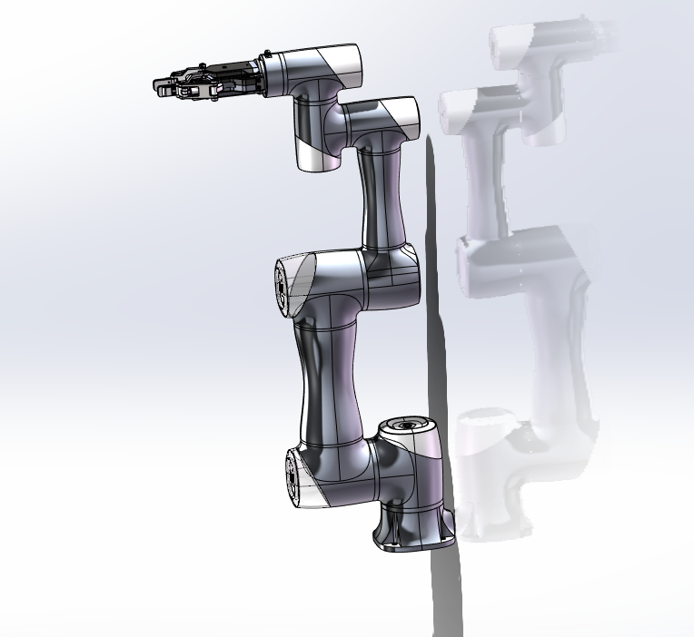

# SW21-URDF-STP

六轴机械臂与电动二指夹爪的 SolidWorks 2021、STEP、原始 SW2URDF 导出文件，以及可在 ROS 2 / RViz2 中加载的 URDF description 功能包。

> 当前 ROS 2 包用于模型、关节状态和 TF 的可视化验证，不是可直接用于 Gazebo / Isaac Sim、MoveIt 2、`ros2_control` 或真实机械臂的完整工程。



## 仓库内容

| 路径 | 内容 | 当前用途 |
| --- | --- | --- |
| `SolidWorks/CR7AS+AG165-90.zip` | SolidWorks 2021 Pack and Go 压缩包 | 查看和继续编辑 CAD 装配体 |
| `STEP/CR7AS+AG-160-95.STEP` | AP203 STEP 通用交换文件 | 在其他 CAD 软件中查看或转换实体几何 |
| `Images/` | 模型预览图 | 快速查看模型外观 |
| `URDF/URDF-ROS1/` | SolidWorks 插件导出的 ROS 1 / Catkin 风格原始包 | 保留原始导出结果、用于转换对照 |
| `URDF/URDF-ROS2/` | 整理后的 ROS 2 description 包 | 在 ROS 2 中构建并用 RViz2 显示 |
| `ROS2/RViz2/urdf_sw_description/` | 与 `URDF/URDF-ROS2/` 内容相同的 ROS 2 包副本 | 按用途直接复制到 ROS 2 工作空间 |
| `SolidWorks2021_URDF到ROS2Foxy_RViz2通用转换模板.md` | 本模型的完整转换说明与检查方法 | 理解转换过程和排查问题 |
| `SW2URDF转ROS2_Foxy通用转换模板_公开版.md` | 面向其他 SW2URDF 项目的通用模板 | 转换其他机械臂或夹爪模型 |

SolidWorks 与 STEP 文件名中的夹爪型号写法并不一致（`AG165-90` 与 `AG-160-95`）。仓库中没有提供可核验的料号说明，请在制造、采购或实机匹配前自行确认准确型号和版本。

## 当前 ROS 2 模型

ROS 2 功能包名为 `urdf_sw_description`，机器人以 `base_link` 为根坐标系，包含：

- 9 个 link；
- 1 个固定关节 `base_link_to_b0`；
- 6 个旋转关节 `j1` 到 `j6`；
- 1 个直线关节 `gripper_slider_joint`；
- STL visual / collision 网格、惯性参数、RViz2 配置和 ROS 2 Python launch 文件。

启动文件会同时打开：

- `joint_state_publisher_gui`：通过滑块改变活动关节值；
- `robot_state_publisher`：根据 URDF 和 `/joint_states` 发布 TF；
- RViz2：显示 `RobotModel` 与 TF，固定坐标系为 `base_link`。

## ROS 2 Foxy + RViz2 快速开始

下面以 Ubuntu 20.04 + ROS 2 Foxy 和 `~/dev_ws` 工作空间为例。请先按照 ROS 2 官方文档正确安装 Foxy。

### 1. 获取包含 Git LFS 大文件的仓库

```bash
sudo apt update
sudo apt install git-lfs
git lfs install
git clone https://github.com/wky-1-dotcom/SW21-URDF-STP.git
cd SW21-URDF-STP
git lfs pull
```

GitHub 网页的 `Download ZIP` 可能无法可靠取得 Git LFS 管理的大文件，因此推荐使用 Git + Git LFS 克隆。若已经克隆仓库但 ZIP、STEP 或 SolidWorks 文件只有几百字节，请执行 `git lfs pull`。

### 2. 安装显示和构建依赖

```bash
sudo apt install \
  python3-colcon-common-extensions \
  ros-foxy-joint-state-publisher-gui \
  ros-foxy-robot-state-publisher \
  ros-foxy-rviz2
```

### 3. 放入工作空间并构建

在仓库根目录执行：

```bash
mkdir -p ~/dev_ws/src
cp -a ROS2/RViz2/urdf_sw_description ~/dev_ws/src/

source /opt/ros/foxy/setup.bash
cd ~/dev_ws
colcon build --symlink-install --packages-select urdf_sw_description
source install/setup.bash
```

必须复制整个 `urdf_sw_description` 目录，不能只复制 `.urdf` 文件，因为模型还依赖 `meshes`、`launch`、`rviz`、`package.xml` 和 `CMakeLists.txt`。

### 4. 启动

```bash
ros2 launch urdf_sw_description display.launch.py
```

正常情况下会出现 RViz2 和 Joint State Publisher GUI。拖动 `j1` 到 `j6` 或 `gripper_slider_joint` 的滑块，RViz2 中的模型应同步运动。

如使用 Ubuntu 22.04 + ROS 2 Humble，可将命令中的 `foxy` 替换为 `humble`。该包只使用常规 ament、launch 和 RViz2 接口，但发布前仍建议在目标 ROS 2 发行版上重新构建并验证。

## ROS 1 原始包与 ROS 2 包的区别

`URDF/URDF-ROS1/` 是 SW2URDF 的原始导出结果，采用 Catkin、ROS 1 XML launch 和原包资源路径，不能直接作为 ROS 2 包构建。它还保留了将夹爪滑块错误关联到腕关节 `j6` 的 mimic 配置，因此仅作为原始资料和转换对照。

ROS 2 包完成了以下整理：

- 使用合法且统一的包名、机器人名、文件名和 `package://` mesh URI；
- 改为 `ament_cmake`、ROS 2 Python launch 与 RViz2 配置；
- 增加固定根坐标系 `base_link`；
- 将通用的 `link` / `jlink` 重命名为 `gripper_link` / `gripper_slider_joint`；
- 删除错误的夹爪滑块与 `j6` mimic 关系；
- 提供 Joint State Publisher GUI，以便独立检查每个活动关节。

详细修改依据和“修改前 / 修改后”示例见：

- [SolidWorks 2021 导出的 URDF 转为 ROS 2 Foxy / RViz2 可完整显示的通用模板](SolidWorks2021_URDF到ROS2Foxy_RViz2通用转换模板.md)
- [SW2URDF 导出包转 ROS 2 Foxy 通用转换模板（公开版）](SW2URDF转ROS2_Foxy通用转换模板_公开版.md)

## CAD 文件使用说明

### SolidWorks 2021

1. 使用 Git LFS 完整下载 `SolidWorks/CR7AS+AG165-90.zip`。
2. 将压缩包完整解压，保持 Pack and Go 生成的目录和文件关系不变。
3. 使用 SolidWorks 2021 或能够兼容该版本文件的更高版本打开主 `.SLDASM` 装配体。
4. 如果出现零件丢失，使用 SolidWorks 的“查找引用”重新定位同一解压目录中的 `.SLDPRT` 文件。

### STEP

`STEP/CR7AS+AG-160-95.STEP` 可导入 SolidWorks、FreeCAD、Fusion 360、Inventor、Creo 等支持 STEP 的 CAD 软件。它是 AP203 交换文件，主要用于传递几何和装配结构；不要假定它保留 SolidWorks 参数化特征树、原始配合关系或完整材料信息。

## 已知限制

- 当前夹爪在 URDF 中只建模为一个直线活动部件，未完整表达丝杠、左右指爪和连杆之间的机械耦合。真实联动需要根据丝杠导程与机构关系补充关节、mimic 或控制逻辑。
- `j1` 到 `j6` 的 `-1.57` 到 `1.57 rad`，以及夹爪滑块的 `-0.02` 到 `0.02 m`，是当前可视化参数，不是厂家或实机安全限位。
- URDF 中的 effort、velocity、质量、惯量和坐标轴必须结合厂家资料、CAD 材料配置与实测再次校核。
- visual 与 collision 当前复用详细 STL。RViz2 可以显示，但物理仿真和碰撞规划应另做低面数、封闭且尽量凸的 collision 几何。
- 当前包没有 Gazebo / Isaac Sim 插件、transmission、`ros2_control` 配置、MoveIt 2 配置、控制器参数或厂商驱动。
- RViz2 只负责可视化 URDF、TF、关节状态和其他 ROS 数据，不执行刚体动力学，也不能替代碰撞仿真或真实控制器。

## 用于仿真或实机前

在 Gazebo、Isaac Sim、MoveIt 2 或真实机械臂中使用前，至少需要完成：

1. 依据厂家数据校准 joint origin、axis、限位、速度、力矩、质量和惯量；
2. 为机械臂和夹爪制作合适的简化 collision 模型，并在 MoveIt 2 Planning Scene 或仿真器中验证自碰撞与环境碰撞；
3. 根据真实丝杠机构建立夹爪联动关系；
4. 添加 `ros2_control`、transmission、控制器和对应硬件接口；
5. 先在低速、限力、具备急停与隔离区域的条件下验证，不能仅凭 RViz2 显示结果驱动实机。

## 许可证与引用

ROS 2 包的 `package.xml` 当前声明 `BSD-3-Clause`，但仓库根目录尚未提供对应的 `LICENSE` 文件，CAD、STEP、网格和图片的授权范围也未单独说明。在许可证补齐前，请不要默认这些模型资源已获得复制、修改或商用授权；公开复用或再分发前请先联系仓库作者确认。

如果后续正式采用 BSD-3-Clause，建议在仓库根目录添加完整的 `LICENSE` 文件，并明确该许可证是否覆盖 CAD、STEP、STL、图片、代码和文档。
